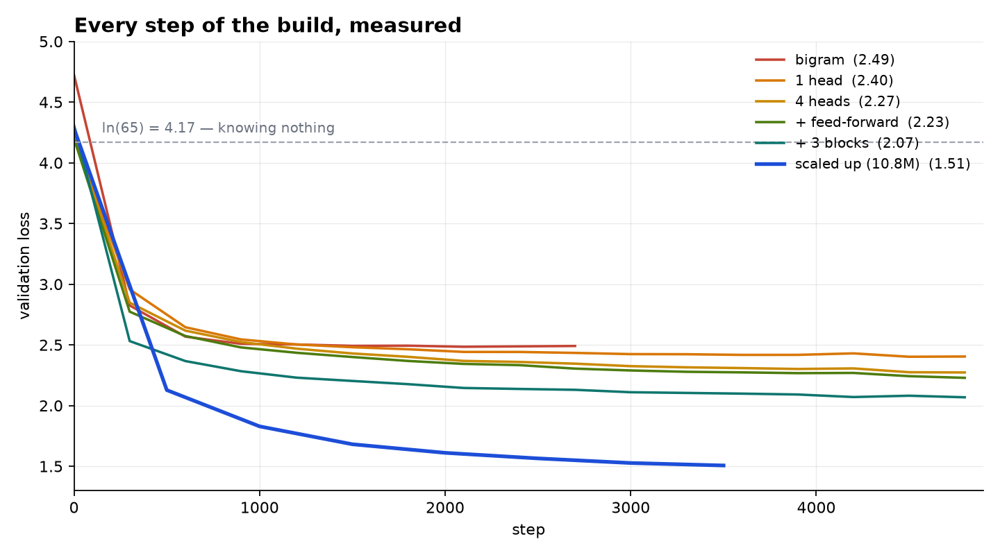

<div align="center">


# tiny-llm

**Building a GPT from scratch, one runnable step at a time.**

From a 4,225-number lookup table to a 10.8M-parameter transformer that writes Shakespeare.
No frameworks beyond PyTorch, every step small enough to read in one sitting.

<sub>Python 3.12 · PyTorch · CUDA optional</sub>

</div>

---

## What this is

A learning project, built from nothing, in order. Each step is a standalone script you
run and watch. The loss drops, the output improves, and the reason why is written down.

```
 step            params     val loss   what it can do
─────────────────────────────────────────────────────────────────
 bigram           4,225       2.45     believable letter pairs
 1 attention head 7,553       2.40     looks back at its context
 4 heads          7,553       2.27     asks four questions at once
 + feed-forward   8,609       2.21     thinks after gathering
 + 3 blocks      42,369       2.07     near-words, correct format
 scaled up    10,788,929      1.49     real words, real structure
```



Every line is a real run. The dashed line is `ln(65) = 4.17`, the loss of guessing evenly
across the 65-character vocabulary — the bar any working model has to get under.

Output from the final model:

```
To have this life up against the ensign'd
To spit again; occeannow, to Bringot, lazy
To there that be successes in a mildery fied
Till his best with rond, the roar
And his best noble potion. Why, and he you must
Say you terra; let me go
That Edward so Rivers; and your brother usurp
```

---

## Install

```bash
git clone https://github.com/TomasSirotek/tiny-llm
cd tiny-llm

uv venv --python 3.12
source .venv/bin/activate
uv pip install torch numpy requests pytest
```

CUDA is optional. Without a GPU everything still runs — the final model just takes
hours instead of minutes. Check with:

```bash
python -c "import torch; print(torch.cuda.is_available())"
```

## Use

```bash
python train.py            # trains and checkpoints to checkpoints/model.pt
python chat.py             # type a prompt, the model continues it
pytest                     # 15 tests
```

The corpus downloads itself on first run (~1 MB of Shakespeare).

Training the full model takes about 12 minutes on an RTX 4050. To try something smaller
first, edit the config:

```python
cfg = Config(n_layer=2, n_embd=64, block_size=32, max_iters=1000)
```

---

## Layout

```
steps/       the tutorial — each file standalone, read top to bottom
notes/       what each step taught, in plain language
tinyllm/     the library — config, tokenizer, data, model, train, generate
tests/       15 tests, including the one that proves attention can't see the future
```

`steps/` never imports `tinyllm/`. The tutorial files keep their own copies so nothing
is hidden behind an import. The library is what `train.py` and `chat.py` use.

### The steps

| # | file | idea |
|---|------|------|
| 1 | `data.py` | text is one long stream of characters |
| 2 | `tokenizer.py` | characters become integers, reversibly |
| 3 | `bigram.py` | a lookup table that predicts the next character |
| 4 | `backprop.py` | gradients by hand — nudge a number, watch the loss |
| 5 | `attention.py` | a position looks back and decides what mattered |
| 6 | `model.py` | multi-head, feed-forward, residuals, layer norm, stacked |
| 7 | `sample.py` | temperature and top-k |

Each has a matching note in `notes/` — including the mistakes, because those turned out
to be the parts worth writing down.

---

## What it can't do

It writes text shaped like Shakespeare. It cannot answer questions about Shakespeare.

This is a **base model** — a next-character predictor, nothing more. It has no facts
(10.8M parameters on 1 MB of text can't store any) and has never seen a question followed
by an answer. Every LLM starts here; the assistant behaviour comes later, from instruction
tuning and retrieval on top of a far bigger base.

Knowing exactly why that is, is most of the point of building it.

---

## Credits

The architecture follows Andrej Karpathy's
[nanoGPT](https://github.com/karpathy/nanoGPT)
Corpus is TinyShakespeare.

## License

MIT — see [LICENSE](LICENSE).
